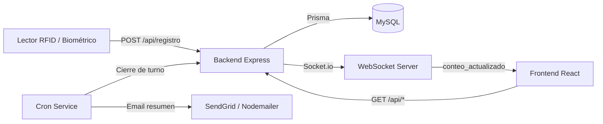
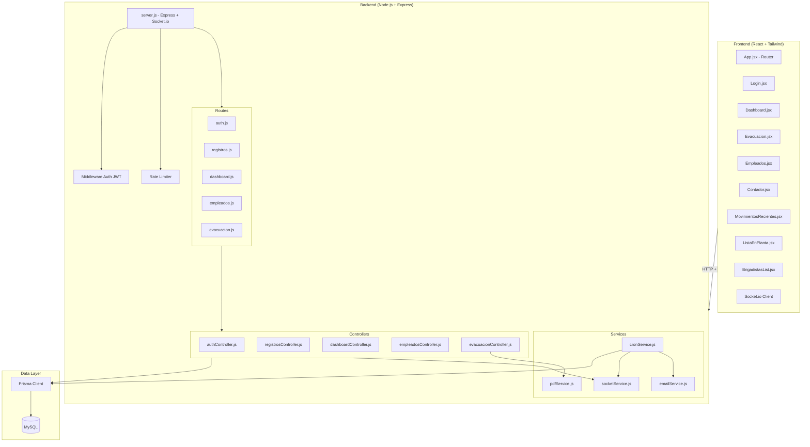
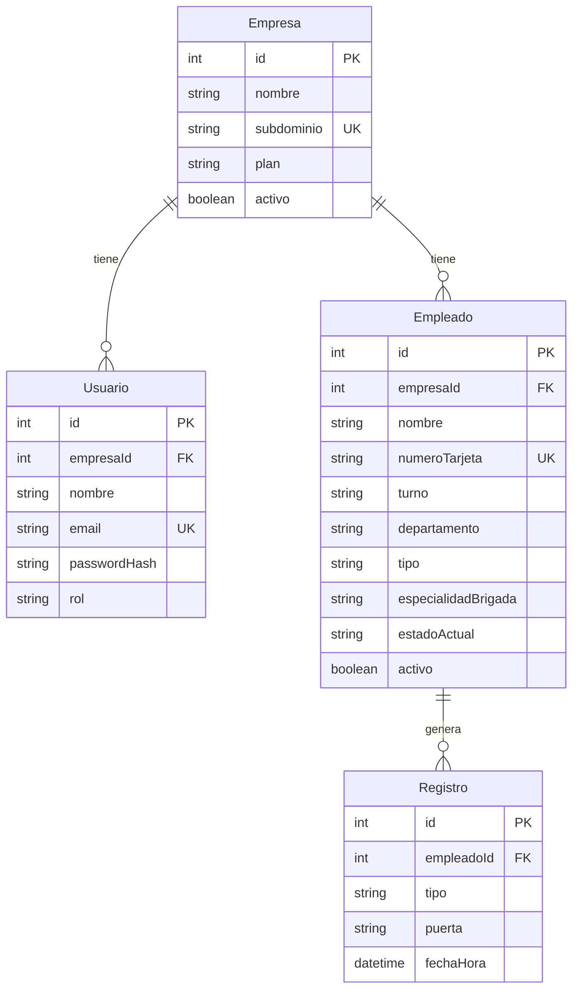

# Documento de Diseño — SafeCountix

## Overview

SafeCountix es un sistema web SaaS en tiempo real para el control de presencia de personal en plantas industriales. El sistema recibe eventos de lectores biométricos Grupotress (huella + RFID) y mantiene un conteo exacto de personas dentro de la instalación, con soporte para evacuaciones de emergencia.

La arquitectura sigue un modelo cliente-servidor con comunicación bidireccional en tiempo real:

- **Backend**: Node.js + Express como API REST, Socket.io para eventos en tiempo real, Prisma ORM sobre MySQL, y tareas cron para cierre automático de turnos.
- **Frontend**: React SPA con Tailwind CSS, consumiendo la API REST y suscribiéndose a eventos Socket.io.
- **Hosting**: Railway para despliegue de backend, frontend y base de datos MySQL.

El flujo principal es: un lector RFID envía el `numeroTarjeta` y la `puerta` al endpoint `POST /api/registro`. El backend determina si es entrada o salida (toggle), actualiza el estado del empleado, crea el registro y emite un evento Socket.io que actualiza todos los dashboards conectados en tiempo real.



## Architecture

### Diagrama de componentes



### Patrones arquitectónicos

1. **MVC adaptado**: Routes → Controllers → Prisma (Models). Los controllers contienen la lógica de negocio y los routes definen los endpoints.
2. **Servicios transversales**: Socket.io, Cron, Email y PDF se encapsulan en servicios independientes inyectados en los controllers que los necesitan.
3. **Multi-tenancy por filtro**: Cada consulta filtra por `empresaId` del usuario autenticado. No hay bases de datos separadas por empresa.
4. **Toggle de estado**: La lógica de entrada/salida se basa en el campo `estadoActual` del empleado, alternando entre "dentro" y "fuera" con cada registro.

### Decisiones de diseño

| Decisión | Justificación |
|----------|---------------|
| Prisma ORM sobre MySQL | Consultas parametrizadas por defecto (previene SQL injection), migraciones declarativas, tipado fuerte |
| Socket.io sobre WebSockets puros | Reconexión automática, fallback a polling, rooms para multi-tenancy futuro |
| JWT en localStorage | Simplicidad para SPA; el riesgo XSS se mitiga con sanitización de inputs y CSP headers |
| Soft delete para empleados | Preserva integridad referencial con registros históricos |
| Rate limiting en registro | Previene abuso del endpoint más crítico (lectores RFID) |
| Cron con node-cron | Ligero, sin dependencias externas, suficiente para 3 ejecuciones diarias |

## Components and Interfaces

### Backend API Endpoints

#### Auth Service

```
POST /api/auth/login
  Request:  { email: string, password: string }
  Response: { token: string, usuario: { id, nombre, email, rol, empresaId } }
  Errors:   401 - Credenciales inválidas

POST /api/auth/logout
  Headers:  Authorization: Bearer <token>
  Response: { message: "Sesión cerrada" }
```

#### Registro Service (Toggle entrada/salida)

```
POST /api/registro
  Request:  { numeroTarjeta: string, puerta: "peatonal" | "vehicular" }
  Response: { 
    accion: "entrada" | "salida",
    empleado: { id, nombre, tipo, departamento },
    conteo: { totalEnPlanta: number, brigadistas: number, proveedores: number }
  }
  Errors:   404 - Empleado no encontrado
  Rate Limit: 10 req/s por IP
  Side Effect: Emite evento Socket.io "conteo_actualizado"
```

#### Dashboard Service

```
GET /api/dashboard/conteo
  Headers:  Authorization: Bearer <token>
  Response: { totalEnPlanta: number, brigadistas: number, proveedores: number }

GET /api/dashboard/en-planta
  Headers:  Authorization: Bearer <token>
  Response: Empleado[] (estadoActual = "dentro")

GET /api/dashboard/movimientos
  Headers:  Authorization: Bearer <token>
  Response: Registro[] (últimos 20, orden desc por fechaHora)
```

#### Empleados Service (CRUD)

```
GET /api/empleados
  Headers:  Authorization: Bearer <token>
  Response: Empleado[] (activo = true)

POST /api/empleados
  Headers:  Authorization: Bearer <token>
  Request:  { nombre, numeroTarjeta, turno, departamento, tipo, especialidadBrigada? }
  Response: Empleado (creado)
  Errors:   409 - Numero de tarjeta duplicado

PUT /api/empleados/:id
  Headers:  Authorization: Bearer <token>
  Request:  { nombre?, turno?, departamento?, tipo?, especialidadBrigada? }
  Response: Empleado (actualizado)

DELETE /api/empleados/:id
  Headers:  Authorization: Bearer <token>
  Response: { message: "Empleado desactivado" }
  Note:     Soft delete (activo = false)
```

#### Evacuación Service

```
GET /api/evacuacion/en-planta
  Headers:  Authorization: Bearer <token>
  Response: Empleado[] (estadoActual = "dentro")

GET /api/evacuacion/brigadistas
  Headers:  Authorization: Bearer <token>
  Response: Empleado[] (tipo = "brigadista", estadoActual = "dentro", incluye especialidadBrigada)

GET /api/evacuacion/pdf
  Headers:  Authorization: Bearer <token>
  Response: application/pdf (documento generado con pdfkit)
```

### Socket.io Events

```
Server → Client:
  "conteo_actualizado" → { 
    totalEnPlanta: number, 
    brigadistas: number, 
    proveedores: number, 
    ultimoMovimiento: { empleadoNombre, tipo, puerta, fechaHora } 
  }

  "evacuacion_activada" → { 
    timestamp: string (ISO 8601), 
    listaEnPlanta: Empleado[] 
  }
```

### Frontend Components

| Componente | Responsabilidad |
|------------|----------------|
| `App.jsx` | Router principal, manejo de autenticación global |
| `Login.jsx` | Formulario de login, llamada a auth API, almacenamiento de JWT |
| `Dashboard.jsx` | Vista principal con conteo, movimientos y lista en planta |
| `Evacuacion.jsx` | Modo evacuación con pestañas, cronómetro y descarga PDF |
| `Empleados.jsx` | CRUD de empleados con tabla filtrable |
| `Contador.jsx` | Componente del número grande de personas en planta |
| `MovimientosRecientes.jsx` | Lista de últimos 20 movimientos |
| `ListaEnPlanta.jsx` | Lista lateral de personas actualmente dentro |
| `BrigadistasList.jsx` | Lista de brigadistas con especialidad |

### Services (Backend)

| Servicio | Archivo | Responsabilidad |
|----------|---------|----------------|
| Socket Service | `socketService.js` | Gestión de conexiones Socket.io, emisión de eventos |
| Cron Service | `cronService.js` | Cierre automático de turnos a las 06:00, 14:00, 22:00 |
| Email Service | `emailService.js` | Envío de correos vía SendGrid/Nodemailer |
| PDF Service | `pdfService.js` | Generación de PDFs de emergencia con pdfkit |

## Data Models

### Diagrama Entidad-Relación



### Prisma Schema

```prisma
model Empresa {
  id         Int        @id @default(autoincrement())
  nombre     String
  subdominio String     @unique
  plan       String     @default("basico")
  activo     Boolean    @default(true)
  usuarios   Usuario[]
  empleados  Empleado[]
}

model Usuario {
  id            Int     @id @default(autoincrement())
  empresaId     Int
  nombre        String
  email         String  @unique
  passwordHash  String
  rol           String  // "admin" | "seguridad" | "rh"
  empresa       Empresa @relation(fields: [empresaId], references: [id])
}

model Empleado {
  id                  Int        @id @default(autoincrement())
  empresaId           Int
  nombre              String
  numeroTarjeta       String     @unique
  turno               String     // "manana" | "tarde" | "noche"
  departamento        String
  tipo                String     // "empleado" | "brigadista" | "proveedor"
  especialidadBrigada String?    // "primeros_auxilios" | "evacuacion" | "comunicacion" | "busqueda"
  estadoActual        String     @default("fuera") // "dentro" | "fuera"
  activo              Boolean    @default(true)
  empresa             Empresa    @relation(fields: [empresaId], references: [id])
  registros           Registro[]
}

model Registro {
  id         Int      @id @default(autoincrement())
  empleadoId Int
  tipo       String   // "entrada" | "salida" | "salida_automatica"
  puerta     String   // "peatonal" | "vehicular"
  fechaHora  DateTime @default(now())
  empleado   Empleado @relation(fields: [empleadoId], references: [id])
}
```

### Enumeraciones lógicas (validadas en código)

| Campo | Valores válidos |
|-------|----------------|
| `Usuario.rol` | `admin`, `seguridad`, `rh` |
| `Empleado.turno` | `manana`, `tarde`, `noche` |
| `Empleado.tipo` | `empleado`, `brigadista`, `proveedor` |
| `Empleado.especialidadBrigada` | `primeros_auxilios`, `evacuacion`, `comunicacion`, `busqueda`, `null` |
| `Empleado.estadoActual` | `dentro`, `fuera` |
| `Registro.tipo` | `entrada`, `salida`, `salida_automatica` |
| `Registro.puerta` | `peatonal`, `vehicular` |

### Mapeo turno → hora de cierre

| Turno | Hora de cierre cron |
|-------|-------------------|
| `noche` | 06:00 |
| `manana` | 14:00 |
| `tarde` | 22:00 |

## Correctness Properties

*Una propiedad de correctitud es una característica o comportamiento que debe cumplirse en todas las ejecuciones válidas de un sistema — esencialmente, una declaración formal sobre lo que el sistema debe hacer. Las propiedades sirven como puente entre especificaciones legibles por humanos y garantías de correctitud verificables por máquina.*

### Property 1: Verificación de contraseña round-trip

*For any* par válido de (contraseña, hash_bcrypt), la función de login SHALL retornar un JWT con datos correctos del usuario cuando `bcrypt.compare(contraseña, hash)` es verdadero, y SHALL rechazar con 401 cuando `bcrypt.compare(contraseña, hash)` es falso.

**Validates: Requirements 1.1, 1.2**

### Property 2: Middleware JWT rechaza tokens inválidos

*For any* token JWT que esté expirado, malformado o ausente, el middleware de autenticación SHALL retornar HTTP 401 y rechazar la solicitud en cualquier endpoint protegido.

**Validates: Requirements 1.5, 9.1, 9.5**

### Property 3: Toggle entrada/salida como máquina de estados

*For any* empleado activo, si su `estadoActual` es "fuera" y se procesa un registro, el sistema SHALL crear un Registro de tipo "entrada" y cambiar `estadoActual` a "dentro". Si su `estadoActual` es "dentro", SHALL crear un Registro de tipo "salida" y cambiar `estadoActual` a "fuera". En ambos casos, el estado final debe ser el opuesto al estado inicial.

**Validates: Requirements 2.2, 2.3**

### Property 4: Cálculo correcto del conteo neto

*For any* conjunto de empleados con estados variados, el conteo SHALL cumplir: `totalEnPlanta` = cantidad de empleados con `estadoActual="dentro"`, `brigadistas` = cantidad con `estadoActual="dentro"` AND `tipo="brigadista"`, `proveedores` = cantidad con `estadoActual="dentro"` AND `tipo="proveedor"`.

**Validates: Requirements 3.1**

### Property 5: Filtro de personal en planta

*For any* conjunto de empleados, la consulta de "en planta" SHALL retornar exactamente los empleados con `estadoActual="dentro"` — sin omitir ninguno que esté dentro y sin incluir ninguno que esté fuera.

**Validates: Requirements 3.2, 4.5**

### Property 6: Movimientos ordenados y limitados

*For any* conjunto de registros, la consulta de movimientos SHALL retornar como máximo 20 registros, y estos SHALL estar ordenados por `fechaHora` en orden descendente (el más reciente primero).

**Validates: Requirements 3.3**

### Property 7: Filtro de brigadistas con especialidad

*For any* conjunto de empleados, la consulta de brigadistas SHALL retornar únicamente empleados con `tipo="brigadista"` AND `estadoActual="dentro"`, y cada resultado SHALL incluir el campo `especialidadBrigada`.

**Validates: Requirements 4.6**

### Property 8: Búsqueda por nombre en listas

*For any* lista de empleados y cadena de búsqueda, el filtro SHALL retornar únicamente empleados cuyo `nombre` contenga la cadena de búsqueda (case-insensitive), sin omitir coincidencias ni incluir no-coincidencias.

**Validates: Requirements 4.7**

### Property 9: Generación de PDF con contenido correcto

*For any* conjunto de empleados en planta y datos de empresa, la función de generación de PDF SHALL producir un buffer PDF válido (no vacío) que contenga la fecha/hora de generación, el nombre de la empresa, el conteo total y los datos de cada empleado (nombre, tipo, departamento, turno).

**Validates: Requirements 5.1, 5.2**

### Property 10: Filtro de empleados activos

*For any* conjunto de empleados con valores variados de `activo`, la consulta de listado SHALL retornar exactamente los empleados con `activo=true` — sin omitir activos ni incluir inactivos.

**Validates: Requirements 6.1**

### Property 11: Creación de empleado con defaults correctos

*For any* datos válidos de empleado nuevo, al crearlo el sistema SHALL asignar `estadoActual="fuera"` y `activo=true` por defecto, independientemente de los datos de entrada.

**Validates: Requirements 6.2**

### Property 12: Actualización de empleado preserva campos no modificados

*For any* empleado existente y subconjunto de campos a actualizar, la operación de actualización SHALL modificar únicamente los campos especificados y preservar todos los demás campos con sus valores originales.

**Validates: Requirements 6.3**

### Property 13: Soft delete establece activo=false sin eliminar registro

*For any* empleado activo, la operación de eliminación SHALL establecer `activo=false` y el registro SHALL seguir existiendo en la base de datos con todos sus datos intactos.

**Validates: Requirements 6.4**

### Property 14: Filtrado de tabla de empleados

*For any* conjunto de empleados y combinación de filtros (turno, departamento, tipo), la tabla filtrada SHALL retornar únicamente empleados que cumplan todos los criterios de filtro aplicados simultáneamente.

**Validates: Requirements 6.6**

### Property 15: Validación de brigadista requiere especialidad

*For any* datos de empleado con `tipo="brigadista"`, la validación SHALL rechazar la creación/edición si `especialidadBrigada` es null o vacío. *For any* datos de empleado con tipo distinto de "brigadista", la validación SHALL aceptar `especialidadBrigada` como null.

**Validates: Requirements 6.8**

### Property 16: Cierre automático de turno

*For any* conjunto de empleados con turnos variados y `estadoActual="dentro"`, cuando el cron se ejecuta a la hora de cierre de un turno, SHALL crear registros de tipo "salida_automatica" únicamente para los empleados del turno que finaliza y que estén "dentro", y SHALL actualizar su `estadoActual` a "fuera". Los empleados de otros turnos SHALL permanecer sin cambios.

**Validates: Requirements 7.1, 7.2**

### Property 17: Aislamiento de datos multi-empresa

*For any* consulta realizada por un usuario autenticado de la empresa A, todos los resultados SHALL pertenecer exclusivamente a la empresa A. Ningún dato de otra empresa SHALL aparecer en los resultados.

**Validates: Requirements 10.2**

## Error Handling

### Estrategia general

El sistema utiliza un enfoque consistente de manejo de errores en todas las capas:

| Capa | Estrategia |
|------|-----------|
| **Controllers** | Try/catch en cada handler. Errores conocidos retornan códigos HTTP específicos. Errores inesperados retornan 500 con mensaje genérico. |
| **Middleware Auth** | Token ausente/inválido/expirado → 401. Sin acceso a ruta → 403. |
| **Prisma** | Errores de constraint único (P2002) → 409. Registro no encontrado (P2025) → 404. Otros errores Prisma → 500. |
| **Socket.io** | Errores de emisión se loguean pero no interrumpen el flujo principal. |
| **Cron** | Errores se loguean. El cron no se detiene por fallos individuales. Email de error al admin si el cierre falla. |

### Códigos de error HTTP

| Código | Escenario |
|--------|-----------|
| 400 | Datos de entrada inválidos (campos faltantes, formato incorrecto, brigadista sin especialidad) |
| 401 | Credenciales inválidas, token JWT ausente/expirado/malformado |
| 404 | Empleado no encontrado por numeroTarjeta o id |
| 409 | Numero de tarjeta duplicado al crear empleado |
| 429 | Rate limit excedido en POST /api/registro |
| 500 | Error interno del servidor |

### Formato de respuesta de error

```json
{
  "error": true,
  "message": "Descripción legible del error",
  "code": "ERROR_CODE"
}
```

Códigos de error internos:
- `INVALID_CREDENTIALS` — Login fallido
- `TOKEN_EXPIRED` — JWT expirado
- `TOKEN_INVALID` — JWT malformado
- `EMPLOYEE_NOT_FOUND` — Empleado no encontrado
- `DUPLICATE_CARD` — Numero de tarjeta duplicado
- `VALIDATION_ERROR` — Datos de entrada inválidos
- `RATE_LIMITED` — Demasiadas solicitudes
- `INTERNAL_ERROR` — Error interno

### Manejo de errores en Socket.io

- Si la emisión de un evento falla, el error se loguea pero la operación HTTP principal (crear registro, etc.) NO se revierte.
- El cliente implementa reconexión automática con backoff exponencial.

### Manejo de errores en Cron

- Si el cierre de turno falla para un empleado individual, se continúa con los demás.
- Al finalizar, se envía email al admin con resumen incluyendo errores si los hubo.
- Si el servicio de email falla, el error se loguea pero el cierre de turno no se revierte.

## Testing Strategy

### Enfoque dual de testing

El proyecto utiliza dos tipos complementarios de tests:

1. **Tests unitarios (example-based)**: Verifican comportamientos específicos, edge cases y condiciones de error con ejemplos concretos.
2. **Tests de propiedades (property-based)**: Verifican propiedades universales que deben cumplirse para cualquier entrada válida, ejecutando mínimo 100 iteraciones por propiedad.

### Herramientas

| Herramienta | Uso |
|-------------|-----|
| **Vitest** | Test runner principal (compatible con el ecosistema Node.js/React) |
| **fast-check** | Librería de property-based testing para JavaScript/TypeScript |
| **Supertest** | Testing de endpoints HTTP |
| **@testing-library/react** | Testing de componentes React |

### Estructura de tests

```
backend/
  __tests__/
    unit/
      authController.test.js
      registrosController.test.js
      dashboardController.test.js
      empleadosController.test.js
      evacuacionController.test.js
      cronService.test.js
      pdfService.test.js
    properties/
      auth.property.test.js
      registro-toggle.property.test.js
      conteo.property.test.js
      filters.property.test.js
      empleados.property.test.js
      cron.property.test.js
      multitenancy.property.test.js
    integration/
      socket.integration.test.js
      api.integration.test.js
frontend/
  __tests__/
    components/
      Dashboard.test.jsx
      Evacuacion.test.jsx
      Empleados.test.jsx
      Login.test.jsx
    properties/
      search-filter.property.test.js
      table-filter.property.test.js
```

### Mapeo de propiedades a tests

Cada property-based test debe:
- Ejecutar mínimo **100 iteraciones**
- Incluir un comentario de tag con formato: `Feature: safecountix, Property {N}: {título}`
- Referenciar la propiedad del documento de diseño que valida

| Propiedad | Archivo de test | Tag |
|-----------|----------------|-----|
| Property 1: Verificación de contraseña | `auth.property.test.js` | `Feature: safecountix, Property 1: Verificación de contraseña round-trip` |
| Property 2: Middleware JWT | `auth.property.test.js` | `Feature: safecountix, Property 2: Middleware JWT rechaza tokens inválidos` |
| Property 3: Toggle entrada/salida | `registro-toggle.property.test.js` | `Feature: safecountix, Property 3: Toggle entrada/salida como máquina de estados` |
| Property 4: Conteo neto | `conteo.property.test.js` | `Feature: safecountix, Property 4: Cálculo correcto del conteo neto` |
| Property 5: Filtro en planta | `filters.property.test.js` | `Feature: safecountix, Property 5: Filtro de personal en planta` |
| Property 6: Movimientos ordenados | `filters.property.test.js` | `Feature: safecountix, Property 6: Movimientos ordenados y limitados` |
| Property 7: Filtro brigadistas | `filters.property.test.js` | `Feature: safecountix, Property 7: Filtro de brigadistas con especialidad` |
| Property 8: Búsqueda por nombre | `search-filter.property.test.js` | `Feature: safecountix, Property 8: Búsqueda por nombre en listas` |
| Property 9: PDF generation | `conteo.property.test.js` | `Feature: safecountix, Property 9: Generación de PDF con contenido correcto` |
| Property 10: Empleados activos | `empleados.property.test.js` | `Feature: safecountix, Property 10: Filtro de empleados activos` |
| Property 11: Defaults de creación | `empleados.property.test.js` | `Feature: safecountix, Property 11: Creación de empleado con defaults correctos` |
| Property 12: Update preserva campos | `empleados.property.test.js` | `Feature: safecountix, Property 12: Actualización preserva campos no modificados` |
| Property 13: Soft delete | `empleados.property.test.js` | `Feature: safecountix, Property 13: Soft delete establece activo=false` |
| Property 14: Filtrado de tabla | `table-filter.property.test.js` | `Feature: safecountix, Property 14: Filtrado de tabla de empleados` |
| Property 15: Validación brigadista | `empleados.property.test.js` | `Feature: safecountix, Property 15: Validación de brigadista requiere especialidad` |
| Property 16: Cierre de turno | `cron.property.test.js` | `Feature: safecountix, Property 16: Cierre automático de turno` |
| Property 17: Multi-tenancy | `multitenancy.property.test.js` | `Feature: safecountix, Property 17: Aislamiento de datos multi-empresa` |

### Tests unitarios (example-based)

Los tests unitarios cubren:
- **Auth**: Login exitoso, logout, redirección por rol (Req 1.3, 1.6)
- **Registro**: Empleado no encontrado 404, rate limiting (Req 2.4, 2.6)
- **Dashboard**: Renderizado de componentes UI, responsividad (Req 3.4, 3.6)
- **Evacuación**: Activación del modo, pestañas, cronómetro, botón PDF, colores por tipo (Req 4.1, 4.3, 4.4, 4.8, 5.3)
- **Empleados**: Confirmación antes de eliminar, tarjeta duplicada 409 (Req 6.5, 6.7)
- **Seed**: Verificación de datos iniciales (Req 11.1–11.4)
- **Visual**: Colores y estilo (Req 12.1–12.3)

### Tests de integración

Los tests de integración cubren:
- **Socket.io**: Emisión de eventos `conteo_actualizado` y `evacuacion_activada` (Req 2.5, 8.1–8.4)
- **Cron + Email**: Envío de resumen post-cierre de turno (Req 7.3, 7.4)
- **API end-to-end**: Flujo completo de registro → actualización de estado → evento socket

### Configuración de smoke tests

- CORS configurado con CLIENT_URL (Req 9.2)
- Prisma usa consultas parametrizadas (Req 9.4)
- Constraints de base de datos (subdominio único, empresaId FK) (Req 10.1, 10.4)
- Bcrypt usa salt rounds = 10 (Req 1.4)
